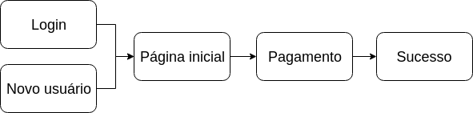
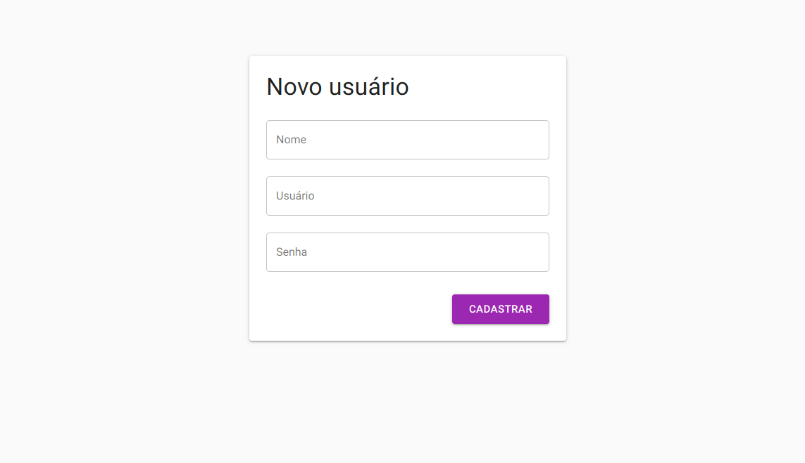
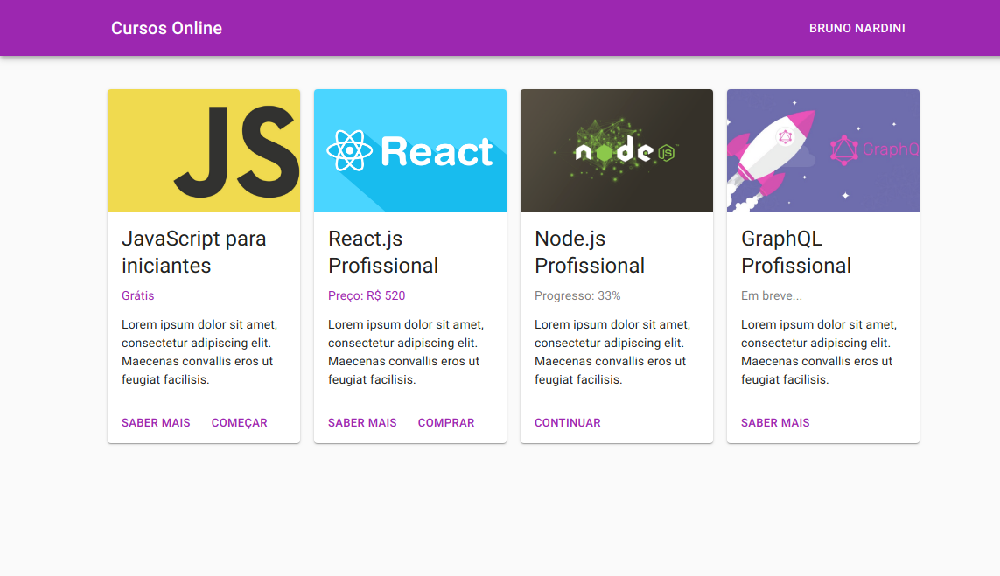
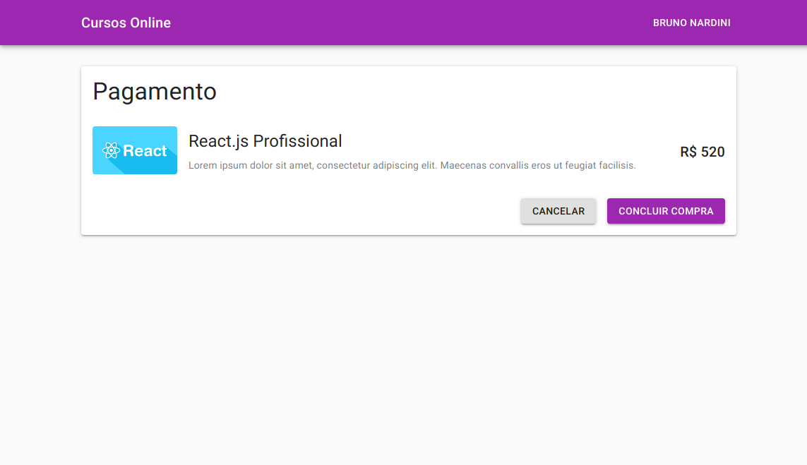
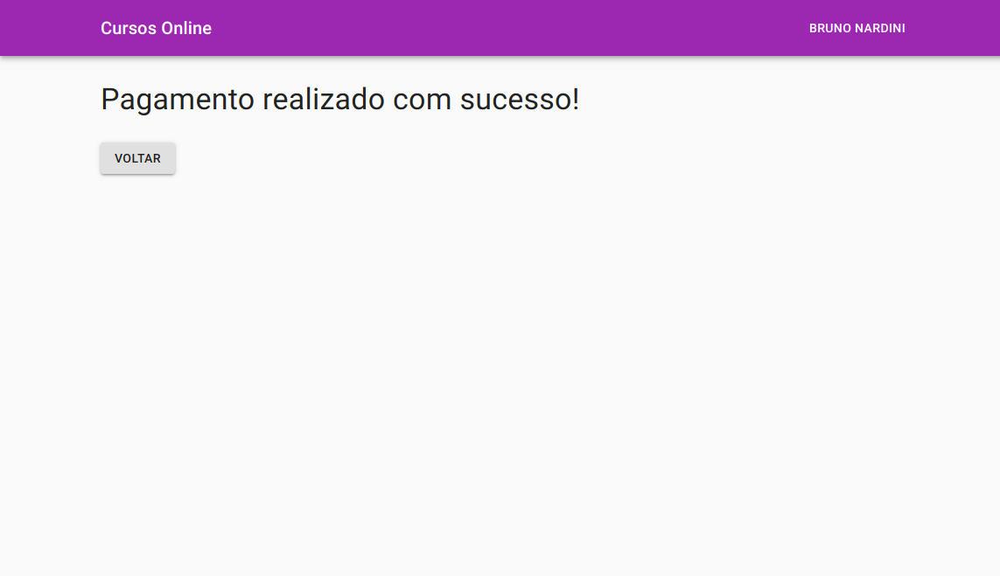

# Refatorando código legado em projetos React

Este projeto é utilizado como fonte para uma série de artigos no Medium.

## Como executar o projeto

Primeiro inicie a API:

```
cd api
npm install
npm start
```

Em seguida o client:

```
cd client
npm install
npm start
```

Depois basta acessar a URL http://localhost:3000/

Você terá que cadastrar um usuário para logar no sistema. A API não usa banco de dados, tudo é salvo em memória.

## Fluxo

O fluxo é bem simples para ser didático:



## Telas

### Login:


### Cadastro de novo usuário:



### Página inicial:



### Pagamento:



### Sucesso do pagamento:


